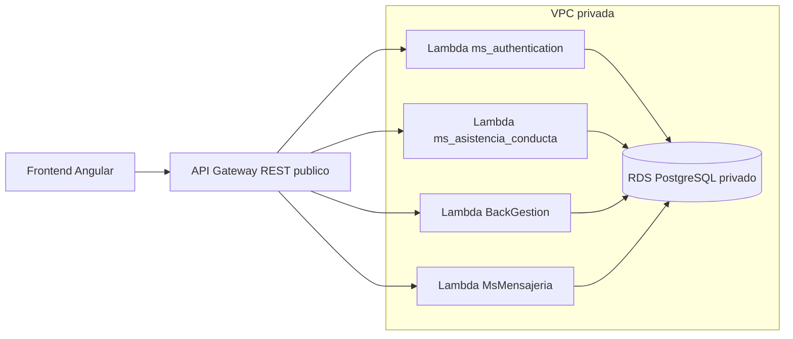

# Design: Crear API Gateway REST y Lambdas de Microservicios

## Resumen
Se reemplazara el `backend_for_frontend` por un API Gateway REST publico. El frontend mantendra los paths que hoy consume del BFF y solo deberia cambiar la URL base.

API Gateway sera responsable de enrutar cada path publico hacia la Lambda del microservicio correspondiente. Para rutas donde el path publico no coincide con el path interno del microservicio, se usara API Gateway REST con integracion Lambda no-proxy y mapping templates para construir un evento compatible con API Gateway proxy, pero con el `path` reescrito al path que espera el microservicio.

No se creara Lambda para `backend_for_frontend`.

## Decisiones Confirmadas
- Usar **API Gateway REST**, no HTTP API.
- Usar `variables.tf` y `terraform.tfvars` para secretos y configuracion sensible.
- `BackGestion` acepta variables de entorno mediante:
  - `DB_URL`
  - `DB_USERNAME`
  - `DB_PASSWORD`
- `MsMensajeria` no usara subida de archivos por ahora.
- No exponer Lambdas con Function URL.

## Arquitectura Propuesta



## Flujo de Datos
1. El frontend llama a la URL publica del API Gateway usando el mismo path que antes usaba contra el BFF.
2. API Gateway identifica la ruta y el metodo.
3. API Gateway invoca la Lambda del microservicio correspondiente.
4. Si el path publico coincide con el path interno, se envia el path sin cambios.
5. Si el path publico no coincide, el mapping template reescribe el `path` del evento antes de invocar la Lambda.
6. El microservicio procesa la request con su framework actual.
7. La Lambda responde en formato compatible con API Gateway.
8. API Gateway devuelve la respuesta al frontend.

## Estrategia de API Gateway REST

### Tipo de integracion
Usar `aws_api_gateway_rest_api`, `aws_api_gateway_resource`, `aws_api_gateway_method`, `aws_api_gateway_integration`, `aws_api_gateway_method_response`, `aws_api_gateway_integration_response` y `aws_lambda_permission`.

Para rutas con path identico se puede usar una plantilla comun que preserve el path.

Para rutas con path distinto se debe usar integracion tipo `AWS` con `request_templates` para construir un evento tipo proxy:

```json
{
  "resource": "$context.resourcePath",
  "path": "<PATH_INTERNO_REESCRITO>",
  "httpMethod": "$context.httpMethod",
  "headers": { ... },
  "queryStringParameters": { ... },
  "pathParameters": { ... },
  "body": "$util.escapeJavaScript($input.body)",
  "isBase64Encoded": false,
  "requestContext": { ... }
}
```

Esto permite que `serverless-http`, `aws-serverless-java-container` y los handlers actuales reciban un evento equivalente al de API Gateway proxy, pero con el path correcto.

### CORS
Configurar CORS en API Gateway para permitir al frontend:
- `OPTIONS`
- `GET`
- `POST`
- `PUT`
- `PATCH`
- `DELETE`
- headers `Authorization`, `Content-Type` y otros requeridos por el frontend.

### Autenticacion
No se implementara authorizer en esta iteracion. API Gateway debe propagar el header `Authorization` hasta el microservicio, porque la validacion de JWT sigue dentro de los servicios.

## Mapeo de Rutas

### Rutas sin rewrite
Estas rutas pueden enviarse al microservicio con el mismo path publico:
- `/api/auth/*` hacia `ms_authentication`
- `/api/mensajes/*` hacia `MsMensajeria`

### Rutas con rewrite
Estas rutas requieren mapping template porque el path publico del BFF no coincide con el path interno:

| Path publico | Lambda destino | Path enviado a Lambda |
|---|---|---|
| `/api/docente/dashboard` | `ms_authentication` | `/api/teachers/me/dashboard` |
| `/api/docente/cursos` | `ms_asistencia_conducta` | `/api/docentes/cursos` |
| `/api/docente/cursos/{id}/alumnos` | `ms_asistencia_conducta` | `/api/cursos/{id}/alumnos` |
| `/api/docente/asistencia` | `ms_asistencia_conducta` | `/api/asistencia` |
| `/api/docente/asistencia/estudiante/{estudiante_id}` | `ms_asistencia_conducta` | `/api/asistencia/estudiante/{estudiante_id}` |
| `/api/docente/anotaciones` | `ms_asistencia_conducta` | `/api/anotaciones` |
| `/api/gestion/cursos` | `BackGestion` | `/api/academico/cursos` |
| `/api/gestion/cursos/{id}` | `BackGestion` | `/api/academico/cursos/{id}` |
| `/api/gestion/asignaturas` | `BackGestion` | `/api/academico/asignaturas` |
| `/api/gestion/asignaturas/{id}` | `BackGestion` | `/api/academico/asignaturas/{id}` |
| `/api/gestion/cad` | `BackGestion` | `/api/academico/cad` |
| `/api/gestion/cad/{id}` | `BackGestion` | `/api/academico/cad/{id}` |
| `/api/gestion/estudiantes*` | `BackGestion` | `/api/estudiantes*` |
| `/api/gestion/evaluaciones*` | `BackGestion` | `/api/evaluaciones*` |
| `/api/gestion/notas*` | `BackGestion` | `/api/notas*` |
| `/api/gestion/usuarios*` | `BackGestion` | `/api/usuarios*` |
| `/api/gestion/docentes*` | `BackGestion` | `/api/docentes*` |

## Modulos y Archivos Esperados

### Root module
Archivos esperados:
- `main.tf`
- `variables.tf`
- `outputs.tf`
- `terraform.tfvars`

Cambios:
- Reemplazar el modulo actual del BFF por modulos de Lambdas por microservicio.
- Crear o llamar al modulo de API Gateway REST.
- Pasar endpoint de RDS y secretos desde variables.
- Mantener ECR para imagenes de microservicios.

### Modulo Lambda reutilizable
Crear un modulo generico, por ejemplo:

```text
modules/lambdas/microservice_lambda/
  main.tf
  variables.tf
  outputs.tf
```

Responsabilidad:
- Crear `aws_lambda_function` package type `Image`.
- Configurar `image_uri`.
- Configurar `role`.
- Configurar `timeout`, `memory_size`, `vpc_config`.
- Configurar variables de entorno por servicio.
- Exponer `function_name`, `invoke_arn`, `arn`.

Este modulo puede reemplazar o generalizar el modulo actual `modules/lambdas/auth_lambda`.

### Modulo API Gateway REST
Crear un modulo, por ejemplo:

```text
modules/api_gateway_rest/
  main.tf
  variables.tf
  outputs.tf
```

Responsabilidad:
- Crear REST API.
- Crear recursos y metodos.
- Crear integraciones Lambda.
- Crear permisos `aws_lambda_permission`.
- Crear deployment y stage.
- Configurar CORS.
- Exponer invoke URL.

## Variables Terraform

### Variables existentes a conservar
- `db_name`
- `db_user`
- `db_password`

`db_password` debe marcarse como `sensitive = true`.

### Variables nuevas sugeridas
- `jwt_secret`, sensitive.
- `resend_api_key`, sensitive.
- `lambda_memory_size`, default `512`.
- `lambda_timeout`, default `30`.
- `api_stage_name`, default `prod`.

### `terraform.tfvars`
Se usara para valores concretos del entorno. No debe versionarse si contiene secretos reales.

Ejemplo conceptual:

```hcl
db_name        = "colegio"
db_user        = "postgres"
db_password    = "<valor-real-local>"
jwt_secret     = "<valor-real-local>"
resend_api_key = "<valor-real-local>"
api_stage_name = "prod"
```

## Variables de Entorno por Lambda

### `ms_authentication`
```hcl
PORT        = "3000"
DB_HOST     = aws_db_instance.colegio_db.address
DB_PORT     = "5432"
DB_DATABASE = var.db_name
DB_USER     = var.db_user
DB_PASSWORD = var.db_password
JWT_SECRET  = var.jwt_secret
```

### `ms_asistencia_conducta`
```hcl
PORT        = "3001"
DB_HOST     = aws_db_instance.colegio_db.address
DB_PORT     = "5432"
DB_DATABASE = var.db_name
DB_USER     = var.db_user
DB_PASSWORD = var.db_password
JWT_SECRET  = var.jwt_secret
```

### `BackGestion`
`BackGestion` usa `application.properties` con placeholders Spring:

```properties
spring.datasource.url=${DB_URL:<fallback-local>}
spring.datasource.username=${DB_USERNAME:<fallback-local>}
spring.datasource.password=${DB_PASSWORD:<fallback-local>}
```

Por eso la Lambda debe recibir:

```hcl
DB_URL      = "jdbc:postgresql://${aws_db_instance.colegio_db.address}:5432/${var.db_name}"
DB_USERNAME = var.db_user
DB_PASSWORD = var.db_password
```

### `MsMensajeria`
```hcl
PORT        = "3002"
DB_HOST     = aws_db_instance.colegio_db.address
DB_PORT     = "5432"
DB_DATABASE = var.db_name
DB_USER     = var.db_user
DB_PASSWORD = var.db_password
API_RESEND  = var.resend_api_key
UPLOAD_PATH = "/tmp"
```

La subida de archivos queda fuera de uso por ahora. `UPLOAD_PATH` se mantiene solo para no romper inicializacion si el servicio lo espera.

## Seguridad y Red
- Las Lambdas deben usar `private_subnets` de `module.vpc_colegio`.
- Las Lambdas deben usar `module.sg_backend.sg_backend_id`.
- RDS debe conservar `module.sg_database`, que ya permite acceso desde el security group backend.
- API Gateway invoca Lambdas mediante permisos `aws_lambda_permission` limitados al ARN de execution del API Gateway.
- No usar Lambda Function URLs.
- No hardcodear secretos en HCL.

## Construccion de Imagenes
La infraestructura espera imagenes en ECR. El proceso de build/push de imagenes no queda completamente resuelto por este design, pero se debe asumir:
- cada microservicio tiene Dockerfile o build compatible;
- cada imagen se publica en el repositorio ECR correspondiente;
- Terraform recibe `image_uri` desde los outputs del modulo ECR o desde variables.

Repositorios ECR actuales esperados:
- `ecr-colegio-auth`
- `ecr-colegio-attendance`
- `ecr-colegio-gestion`
- `ecr-colegio-comunicaciones`

## Riesgos Tecnicos
- **Mapping templates REST API:** construir eventos compatibles con API Gateway proxy en VTL es delicado. Debe probarse con headers, query params, path params y body.
- **Rutas greedy:** simplifican Terraform, pero pueden complicar rewrites por servicio. Para rutas criticas conviene declarar rutas explicitas.
- **BackGestion cold start:** Spring Boot en Lambda puede tener cold starts altos. Mantener memoria al menos 512 MB y evaluar 1024 MB si el arranque es lento.
- **Mensajeria multipart:** subida de archivos fuera de alcance. Si el frontend intenta enviar archivos, esa ruta puede fallar o debe documentarse como no soportada.
- **Secretos en tfvars:** aunque se usara `terraform.tfvars`, no debe commitearse si contiene valores reales.

## Estrategia de Testing

### Validacion Terraform
- `terraform fmt -recursive`
- `terraform validate`
- `terraform plan`

El plan debe revisarse para confirmar:
- no crea Lambda BFF;
- crea cuatro Lambdas de microservicios;
- crea API Gateway REST;
- no destruye VPC, RDS ni ECR existentes inesperadamente.

### Pruebas de Rutas
Probar con `curl` o Postman contra la URL del API Gateway:
- `POST /api/auth/login`
- `GET /api/auth/profile` con Bearer token.
- `GET /api/docente/dashboard` con Bearer token.
- `GET /api/docente/cursos` con Bearer token.
- `GET /api/gestion/cursos`
- `GET /api/gestion/usuarios`
- `GET /api/mensajes/recibidos/{email}`

### Pruebas de Rewrites
Verificar que las rutas publicas con prefijo `/api/gestion` lleguen a `BackGestion` con el path interno correcto:
- `/api/gestion/cursos` -> `/api/academico/cursos`
- `/api/gestion/usuarios` -> `/api/usuarios`
- `/api/gestion/docentes/cad/all` -> `/api/docentes/cad/all`

## Criterio de Finalizacion del Design
El design queda listo para tareas cuando:
- se acepta usar API Gateway REST con mapping templates;
- se acepta mantener `terraform.tfvars` fuera de versionamiento si contiene secretos;
- se acepta dejar subida de archivos de mensajeria fuera de pruebas;
- se decide si el modulo Lambda sera generico o si se crearan modulos separados por microservicio.
