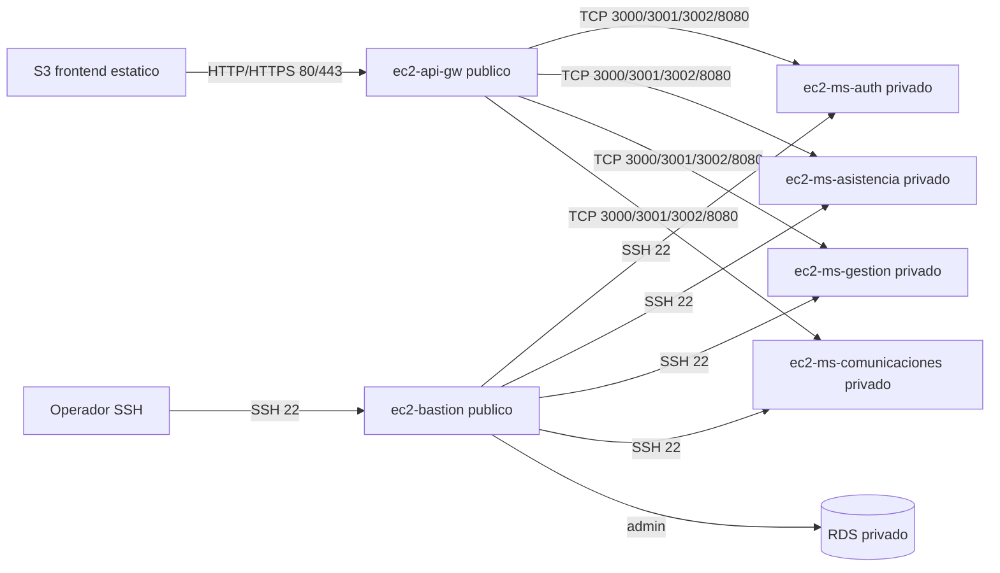

# Design: Crear instancias EC2

## Arquitectura propuesta
La infraestructura debe quedar con dos instancias publicas y cuatro instancias privadas:

## Archivos que probablemente se modificaran
- `main.tf`: declarar las 6 instancias usando `modules/ec2`.
- `outputs.tf`: exponer IPs, URLs y comandos SSH.
- `variables.tf`: agregar variables para key pair, tipo de instancia, CIDR SSH y tamanio de volumen si aplica.
- `modules/ec2/ec2.tf`: mejorar configuracion de Ubuntu, Git, Docker, volumen raiz y outputs.
- `modules/ec2/variables.tf`: agregar variables tipadas, descripciones y defaults seguros.
- `modules/ec2/outputs.tf`: exponer IP publica, IP privada, DNS publico e ID.
- `modules/security_groups/sg_bastion/main.tf`: convertirlo en security group publico para SSH, HTTP y HTTPS.
- `modules/security_groups/sg_backend/main.tf`: permitir SSH y puertos `3000`, `3001`, `3002`, `8080` desde el security group publico.
- `modules/security_groups/sg_backend/variables.tf`: aceptar el security group publico como origen.
- `modules/security_groups/sg_database/main.tf`: revisar que RDS siga privado y administrable desde bastion si es requerido.

## Decisiones de diseno
- Usar una lista/mapa de definicion de instancias en el root module para evitar seis bloques duplicados.
- Mantener `ec2-api-gw` y `ec2-bastion` en subred publica porque son los puntos de entrada requeridos.
- Mantener los microservicios en subred privada y sin IP publica para reducir exposicion.
- Usar `ec2-api-gw` como unico punto de consumo desde S3.
- Usar `ec2-bastion` como unico punto de administracion SSH hacia microservicios y RDS.
- Reutilizar los modulos existentes en vez de crear recursos sueltos.

## Contrato esperado del modulo EC2
El modulo `modules/ec2` debe aceptar al menos:

- `name`: nombre exacto de la instancia.
- `instance_type`: tipo EC2, default `t3.micro`.
- `ami`: AMI Ubuntu.
- `key_name`: nombre del key pair en AWS.
- `subnet_id`: subred destino.
- `security_group_ids`: lista de security groups.
- `root_volume_size`: default minimo `20`.
- `root_volume_type`: default `gp3`.
- `associate_public_ip_address`: boolean para distinguir publicas y privadas.

Debe instalar `git` y `docker` en Ubuntu, habilitar Docker y agregar el usuario `ubuntu` al grupo `docker`.

## Flujo de red
- S3 consume `ec2-api-gw` por `80/443`.
- `ec2-api-gw` consume microservicios privados por `3000`, `3001`, `3002` y `8080`.
- Operador administra `ec2-bastion` por `22`.
- `ec2-bastion` administra microservicios por `22`.
- `ec2-bastion` administra RDS sin exponer RDS a Internet.

## Seguridad
- El CIDR SSH publico debe ser variable. Si se usa `0.0.0.0/0`, debe quedar como decision academica.
- Los microservicios no deben tener IP publica.
- RDS debe conservar `publicly_accessible = false`.
- No se deben commitear secretos ni archivos `.tfstate`.

## Estrategia de validacion
- Ejecutar `terraform fmt -recursive`.
- Ejecutar `terraform validate`.
- Ejecutar `terraform plan` y confirmar:
  - 6 EC2 con nombres exactos.
  - 2 EC2 publicas.
  - 4 EC2 privadas.
  - Puertos `3000`, `3001`, `3002`, `8080` abiertos desde security group publico hacia backend.
  - Outputs con IPs, URLs y comandos SSH.

## Riesgos
- Sin Load Balancer, `ec2-api-gw` es punto unico de falla.
- Sin CloudFront, S3 consumira directamente la IP/DNS publico del API Gateway.
- SSH abierto a Internet facilita pruebas en AWS Academy, pero no es recomendable fuera del entorno academico.
