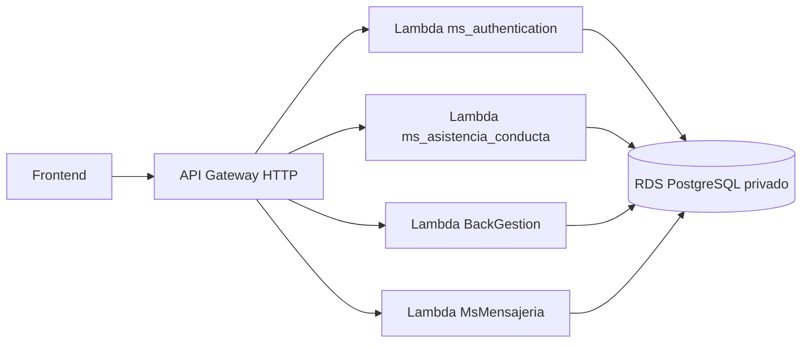

# Design: Integrar API Gateway HTTP con Lambdas

## Resumen
La implementacion debe dejar API Gateway HTTP como una fachada publica simple hacia cuatro Lambdas de microservicios. No debe hacer reescritura de rutas ni actuar como BFF.

El modulo actual `modules/api_gateway_http` ya existe, pero conserva rutas con `overwrite:path`. Este design corrige esa direccion: las rutas publicas del HTTP API deben coincidir con los endpoints reales de los microservicios.

## Arquitectura Propuesta



## Decisiones Tecnicas
- Usar `aws_apigatewayv2_api` con `protocol_type = "HTTP"`.
- Usar `aws_apigatewayv2_integration` con `integration_type = "AWS_PROXY"`.
- Usar `payload_format_version = "2.0"`.
- Usar rutas explicitas por endpoint para facilitar depuracion en AWS Academy.
- No usar `overwrite:path`.
- No usar API Gateway REST.
- No usar mapping templates.
- No usar Lambda Function URLs.

## Flujo de Datos
1. El frontend llama una ruta real de microservicio sobre la URL base del HTTP API.
2. API Gateway HTTP selecciona la ruta.
3. API Gateway invoca la Lambda propietaria del endpoint.
4. La Lambda recibe el evento proxy con metodo, path, headers, query params, path params y body.
5. El microservicio responde.
6. API Gateway devuelve la respuesta al frontend.

## Cambios Esperados

### Root Module
Archivos:
- `main.tf`
- `outputs.tf`

Cambios:
- Mantener `module "api_gateway_http"`.
- No volver a conectar `module "api_gateway_rest"`.
- Mantener output `api_gateway_invoke_url` apuntando al HTTP API.
- Mantener las cuatro Lambdas existentes.

### Modulo HTTP API
Archivos:
- `modules/api_gateway_http/main.tf`
- `modules/api_gateway_http/variables.tf`
- `modules/api_gateway_http/outputs.tf`

Cambios:
- Definir rutas reales de microservicios.
- Eliminar rutas publicas heredadas del BFF que requieran transformacion:
  - `/api/docente/*`
  - `/api/gestion/*`
- Eliminar cualquier `overwrite:path`.
- Integrar rutas de `auth` con `ms_authentication`.
- Integrar rutas de asistencia/conducta con `ms_asistencia_conducta`.
- Integrar rutas academicas con `BackGestion`.
- Integrar rutas de mensajeria con `MsMensajeria`.
- Mantener CORS.
- Mantener permisos `aws_lambda_permission` para el HTTP API.

## Mapeo de Rutas

### `ms_authentication`
Destino: Lambda `ms_authentication_lambda`.

- `POST /api/auth/login`
- `GET /api/auth/validate`
- `GET /api/auth/profile`
- `GET /api/teachers/me/dashboard`

### `ms_asistencia_conducta`
Destino: Lambda `ms_attendance_lambda`.

- `GET /api/docentes/cursos`
- `GET /api/cursos/{id}/alumnos`
- `POST /api/asistencia`
- `GET /api/asistencia/estudiante/{estudiante_id}`
- `GET /api/anotaciones`
- `POST /api/anotaciones`

### `BackGestion`
Destino: Lambda `ms_gestion_lambda`.

- Rutas `/api/academico/*`
- Rutas `/api/estudiantes*`
- Rutas `/api/evaluaciones*`
- Rutas `/api/notas*`
- Rutas `/api/usuarios*`
- Rutas `/api/docentes*`

### `MsMensajeria`
Destino: Lambda `ms_comunicaciones_lambda`.

- Rutas `/api/mensajes*`

## Variables y Secretos
No se requieren variables nuevas para este cambio.

Se conservan:
- `jwt_secret`
- `resend_api_key`
- `db_user`
- `db_password`
- `db_name`
- `lambda_image_tag`
- `api_stage_name`

Los secretos siguen entrando por `terraform.tfvars` y no deben quedar hardcodeados en HCL.

## Ejemplo de Endpoint
Con:

```text
api_gateway_invoke_url = https://abc123.execute-api.us-east-1.amazonaws.com/prod
```

Login:

```bash
curl -X POST "https://abc123.execute-api.us-east-1.amazonaws.com/prod/api/auth/login" \
  -H "Content-Type: application/json" \
  -d '{"email":"admin@colegio.cl","password":"password"}'
```

Consulta de cursos academicos:

```bash
curl "https://abc123.execute-api.us-east-1.amazonaws.com/prod/api/academico/cursos"
```

## Riesgos
- El frontend debe apuntar a rutas reales de microservicios. Si aun usa rutas BFF como `/api/gestion/cursos`, fallara.
- HTTP API no debe asumir transformacion de paths. Cualquier necesidad futura de reescritura debe resolverse agregando alias en microservicios o volviendo a REST API.
- `payload_format_version = "2.0"` debe ser compatible con los handlers actuales. Los servicios Node con `serverless-http` suelen soportarlo; `BackGestion` con `aws-serverless-java-container` debe validarse en AWS.

## Estrategia de Testing
- Ejecutar `terraform fmt -recursive`.
- Ejecutar `terraform validate` en un entorno con providers inicializados.
- Ejecutar `terraform plan` en AWS Academy.
- Validar que no aparezcan recursos `aws_api_gateway_rest_api`.
- Validar que no exista `overwrite:path`.
- Probar login con `POST /api/auth/login`.
- Probar al menos una ruta por microservicio.
