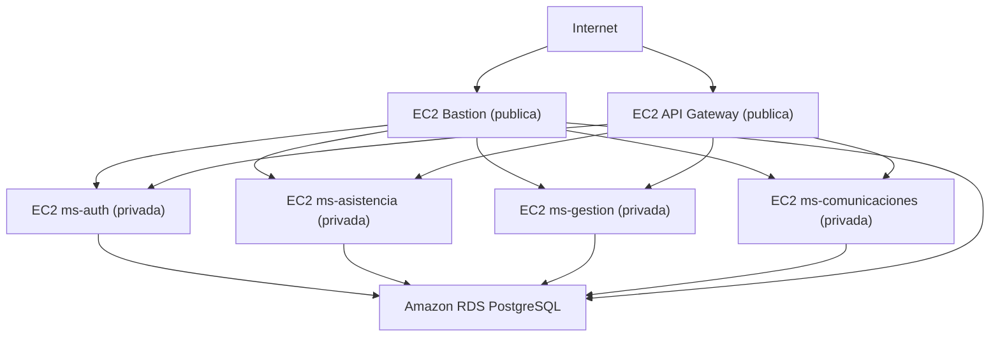

# Infraestructura DevOps Colegio Fullstack III

Este repositorio define la infraestructura base de un sistema escolar desplegado en AWS con Terraform. El diseño actual sigue una topologia de red segmentada con servicios publicos y privados, una capa de base de datos aislada y modulos reutilizables para red, seguridad y computo.

## Objetivo

Provisionar un entorno base para una plataforma compuesta por:

- Un bastion host para acceso administrativo por SSH.
- Un nodo publico para API Gateway o punto de entrada HTTP.
- Cuatro instancias privadas para microservicios.
- Una base de datos PostgreSQL en Amazon RDS.
- Una VPC con subredes publicas y privadas, tablas de ruteo y NAT Gateway.

## Arquitectura actual



## Arquetipos y patrones aplicados

- `Infrastructure as Code`: toda la infraestructura principal se define con Terraform.
- `Arquitectura modular`: los recursos se separan en modulos reutilizables para `vpc`, `ec2` y `security_groups`.
- `Separacion por capas`: red, seguridad, computo y datos se modelan como capas independientes.
- `Topologia publica/privada`: bastion y API Gateway viven en subredes publicas; los microservicios y la base de datos permanecen en subredes privadas.
- `Bastion pattern`: el acceso administrativo a nodos privados se realiza a traves de un salto SSH.
- `Principio de minimo acceso por Security Group`: RDS acepta trafico solo desde los security groups autorizados.
- `Escalado declarativo por mapa`: las instancias EC2 de servicios se generan con `for_each` a partir de `local.ec2_definitions`.

## Estructura del repositorio

```text
.
|-- main.tf
|-- variables.tf
|-- outputs.tf
|-- terraform.tfvars
|-- docker-compose.yml
|-- script.sql
|-- scripts/
|   |-- crear_bastion.sh
|   |-- instalar_ms.sh
|   |-- poblar_datos.sh
|   `-- script.sql
`-- modules/
    |-- ec2/
    |-- vpc/
    `-- security_groups/
        |-- sg_bastion/
        |-- sg_backend/
        `-- sg_database/
```

## Dependencias y prerequisitos

Para trabajar con este proyecto necesitas:

- Terraform `>= 1.5` recomendado.
- Una cuenta o laboratorio AWS con permisos para EC2, VPC, RDS, IAM Role lookup y Key Pair.
- AWS CLI configurado si vas a usar scripts auxiliares o validar recursos manualmente.
- Una clave privada PEM valida disponible en la raiz del proyecto.
- SSH client para conectarte a las instancias.
- Docker y Docker Compose si quieres levantar PostgreSQL localmente.

## Providers usados

El proyecto declara estos providers:

- `hashicorp/aws ~> 5.0`
- `hashicorp/tls ~> 4.0`

## Variables principales

Las variables definidas actualmente son:

| Variable | Descripcion | Valor por defecto |
| --- | --- | --- |
| `aws_region` | Region de despliegue | `us-east-1` |
| `public_ingress_cidr` | CIDR permitido hacia bastion y API Gateway | `0.0.0.0/0` |
| `ec2_key_name` | Nombre del Key Pair en AWS | `165387-vockey` |
| `ec2_instance_type` | Tipo de instancia EC2 | `t3.micro` |
| `ec2_root_volume_size` | Tamano del disco root | `20` |
| `ec2_root_volume_type` | Tipo de volumen root | `gp3` |
| `db_name` | Nombre de la base de datos | sin default |
| `db_user` | Usuario de PostgreSQL | sin default |
| `db_password` | Password de PostgreSQL | sin default |

### Ejemplo de `terraform.tfvars`

```hcl
aws_region        = "us-east-1"
db_name           = "colegio"
db_user           = "postgres"
db_password       = "secure-key"
ec2_instance_type = "t3.micro"
ec2_key_name      = "vockey"
```

## Instalacion

### 1. Clonar el repositorio

```bash
git clone <repo-url>
cd devops
```

### 2. Preparar credenciales AWS

Configura tus credenciales con alguno de estos mecanismos:

- `aws configure`
- Variables de entorno como `AWS_ACCESS_KEY_ID`, `AWS_SECRET_ACCESS_KEY` y `AWS_DEFAULT_REGION`
- Credenciales temporales del laboratorio si trabajas en AWS Academy

### 3. Preparar la clave PEM

En el estado actual del proyecto, `main.tf` lee esta llave:

```text
165387-vockey.pem
```

Debe existir en la raiz del repositorio para que Terraform pueda derivar la clave publica mediante el provider `tls`.

### 4. Inicializar Terraform

```bash
terraform init
```

### 5. Revisar formato y validacion

```bash
terraform fmt -recursive
terraform validate
```

### 6. Revisar el plan

```bash
terraform plan
```

### 7. Aplicar infraestructura

```bash
terraform apply
```

## Como ejecutarlo

### Opcion A: desplegar infraestructura en AWS

Este es el flujo principal del repositorio.

```bash
terraform init
terraform plan
terraform apply
```

Luego puedes inspeccionar los outputs:

```bash
terraform output
```

Outputs relevantes:

- `ec2_instance_addresses`
- `api_gateway_base_url`
- `rds_endpoint`
- `ssh_commands`

### Opcion B: levantar PostgreSQL local con Docker

Si solo quieres disponer de una base local para pruebas:

```bash
docker compose up -d
```

Esto levanta:

- PostgreSQL 15
- Base `colegio`
- Puerto local `5432`
- Carga inicial desde `./script.sql`

Para detenerlo:

```bash
docker compose down
```

Si tambien quieres eliminar el volumen persistente:

```bash
docker compose down -v
```

## Acceso a instancias

Tras `terraform apply`, el output `ssh_commands` entrega comandos listos para:

- `ec2-bastion`
- `ec2-api-gw`
- `ec2-ms-auth`
- `ec2-ms-asistencia`
- `ec2-ms-gestion`
- `ec2-ms-comunicaciones`

Ejemplo general:

```bash
terraform output ssh_commands
```

## Provisionamiento que realiza EC2

El modulo `modules/ec2` usa `user_data` para instalar:

- `git`
- `docker.io`

Ademas habilita y arranca Docker en cada instancia Ubuntu. Esto deja las VMs listas para desplegar contenedores o clonar servicios, pero no instala automaticamente el codigo de los microservicios.

## Seguridad y red

Resumen de reglas actualmente definidas:

- `sg_bastion`: expone `22`, `80` y `443` al `public_ingress_cidr`.
- `sg_backend`: permite `22`, `3000`, `3001`, `3002` y `8080` solo desde el security group publico.
- `sg_database`: permite `5432` solo desde backend y bastion.
- La VPC crea `2` subredes publicas y `4` privadas con un `single NAT Gateway`.

## Scripts auxiliares

El repositorio incluye:

- `scripts/crear_bastion.sh`
- `scripts/instalar_ms.sh`
- `scripts/poblar_datos.sh`

Estado actual:

- `crear_bastion.sh` intenta poblar la base via una EC2 intermedia y AWS CLI.
- `instalar_ms.sh` y `poblar_datos.sh` estan incompletos.
- Hay desalineaciones entre algunos scripts y las variables reales de Terraform, por lo que conviene tratarlos como base de trabajo y no como flujo automatizado final.

## Observaciones importantes del estado actual

- `README.md` estaba vacio; esta version documenta el estado real encontrado en el repo.
- `terraform.tfvars`, `*.tfstate` y archivos `.pem` son sensibles y no deberian versionarse.
- Existe una inconsistencia entre `main.tf` y `terraform.tfvars` respecto al nombre del key pair (`165387-vockey` vs `vockey`).
- El comentario en el modulo VPC menciona Lambda, pero en este repositorio no hay recursos Lambda definidos.
- La infraestructura base esta lista para desplegar entorno, pero el repositorio no incluye aun los microservicios de aplicacion.

## Comandos utiles

```bash
terraform output
terraform output ec2_instance_addresses
terraform output api_gateway_base_url
terraform destroy
```

## Recomendaciones de mejora

- Unificar el nombre del key pair entre `main.tf`, `variables.tf`, `terraform.tfvars` y scripts.
- Completar o depurar los scripts bajo `scripts/`.
- Mover secretos a variables de entorno, `tfvars` no versionados o un secret manager.
- Agregar CI para `terraform fmt`, `validate` y `plan`.
- Incorporar documentacion de despliegue de los microservicios cuando ese repositorio o artefactos existan.
