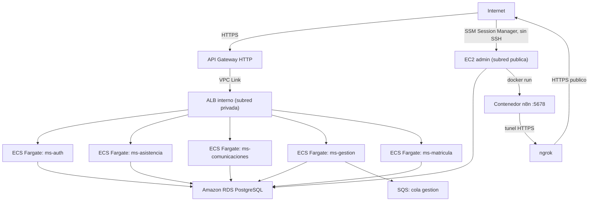

# Infraestructura DevOps Colegio Fullstack III

Este repositorio define la infraestructura de un sistema escolar desplegado en AWS con Terraform. La arquitectura actual es *serverless de contenedores*: los microservicios corren en **ECS Fargate**, quedan detrás de un **ALB interno** expuesto a internet vía **API Gateway HTTP + VPC Link**, con una base de datos **RDS PostgreSQL** aislada en subredes privadas y una **EC2 de administración** (sin SSH, gestionada por SSM) para tareas de DB y para correr n8n.

## Objetivo

Provisionar un entorno para una plataforma compuesta por:

- Cinco microservicios (`ms-auth`, `ms-asistencia`, `ms-comunicaciones`, `ms-gestion`, `ms-matricula`) corriendo como servicios ECS Fargate.
- Un **ALB interno** que enruta por path hacia cada microservicio.
- Un **API Gateway HTTP** público conectado al ALB mediante un **VPC Link**, como único punto de entrada HTTP/HTTPS desde internet hacia el backend.
- Una base de datos **PostgreSQL en Amazon RDS**, accesible solo desde el backend y la EC2 de administración.
- Una cola **SQS** para el microservicio de gestión.
- Una **EC2 de administración** en subred pública, sin acceso SSH (gestión vía SSM Session Manager), usada para administrar el RDS y para correr **n8n** en Docker, expuesto a internet mediante un túnel HTTPS de **ngrok**.
- Una **VPC** con subredes públicas y privadas, NAT Gateway y tablas de ruteo.

## Arquitectura actual



## Arquetipos y patrones aplicados

- `Infrastructure as Code`: toda la infraestructura se define con Terraform, separada por entorno (`enviroments/dev`, `enviroments/prod`).
- `Arquitectura modular`: recursos separados en módulos reutilizables (`vpc`, `alb`, `api_gateway`, `ecs` + `ecs_services`, `ec2`, `security_groups/*`).
- `Contenedores serverless`: los microservicios no corren en EC2 propias, sino como tareas **ECS Fargate**, con autoescalado por CPU (`aws_appautoscaling_policy`).
- `Edge pattern (API Gateway + VPC Link)`: el único punto de entrada público HTTP es el API Gateway; el ALB y los servicios viven en subredes privadas, inalcanzables directamente desde internet.
- `Enrutamiento por path`: el ALB usa `aws_lb_listener_rule` con `path_patterns` y prioridades para dirigir tráfico a cada microservicio.
- `Principio de mínimo acceso por Security Group`: cada capa tiene su propio SG (`sg_alb`, `sg_backend`, `sg_database`, `sg_ec2_admin`) y el RDS solo acepta tráfico desde los SGs autorizados explícitamente.
- `Administración sin SSH`: la EC2 de administración no expone el puerto 22; se gestiona exclusivamente vía **AWS SSM Session Manager**, con egress restringido a HTTP/HTTPS/DNS/Postgres.
- `Sidecar de exposición (ngrok)`: para exponer n8n (que corre en Docker en la EC2 de administración) sin abrir puertos de ingress, se usa un túnel saliente HTTPS de ngrok como servicio `systemd`.

## Estructura del repositorio

```text
.
|-- docker-compose.yml       # Stack local de desarrollo (Postgres, microservicios, RabbitMQ, n8n)
|-- script.sql                # Carga inicial de la base de datos
|-- .env.example               # Variables de entorno para docker-compose
|-- enviroments/
|   |-- dev/                   # Entorno activo (main.tf, variables.tf, outputs.tf, providers.tf, terraform.tfvars)
|   `-- prod/                  # Placeholder aun sin implementar (archivos vacios)
`-- modules/
    |-- vpc/                   # VPC, subredes publicas/privadas, NAT Gateway
    |-- alb/                   # ALB interno + target groups + listener rules por path
    |-- api_gateway/           # API Gateway HTTP + VPC Link hacia el ALB
    |-- ecs/                   # Cluster ECS + un submodulo "ms_*" por microservicio
    |   `-- ecs_services/      # Task definition (Fargate) + service + autoscaling reutilizable
    |-- ec2/                   # EC2 de administracion (Ubuntu, SSM, Docker, ngrok, n8n)
    `-- security_groups/
        |-- sg_alb/
        |-- sg_backend/
        |-- sg_database/
        `-- sg_ec2_admin/
```

## Dependencias y prerequisitos

- Terraform `>= 1.5` recomendado.
- Una cuenta o laboratorio AWS con permisos para ECS, VPC, RDS, ALB, API Gateway, SQS y el rol `LabRole` (AWS Academy).
- AWS CLI configurado, con el plugin `session-manager-plugin` instalado (para conectarte a la EC2 de administración vía SSM).
- Docker y Docker Compose si quieres levantar el stack completo localmente.
- Una cuenta de [ngrok](https://ngrok.com) (plan gratuito sirve) para obtener el `authtoken` que expone n8n por HTTPS.
- **No se necesita clave SSH/PEM**: ninguna instancia expone el puerto 22; toda la administración es por SSM.

## Providers usados

Declarados en `enviroments/dev/providers.tf`:

- `hashicorp/aws ~> 5.0`
- `hashicorp/tls ~> 4.0` (declarado pero sin uso actual en el código; resabio de un esquema anterior con Key Pair — candidato a limpieza).

## Variables principales (`enviroments/dev/variables.tf`)

| Variable | Descripción | Sensible | Valor por defecto |
| --- | --- | --- | --- |
| `aws_region` | Región de despliegue | no | `us-east-1` |
| `public_ingress_cidr` | CIDR usado en reglas públicas | no | `0.0.0.0/0` |
| `ec2_instance_type` | Tipo de instancia para la EC2 de administración | no | `t3.micro` |
| `ec2_root_volume_size` | Tamaño del disco root (GiB) | no | `20` |
| `ec2_root_volume_type` | Tipo de volumen root | no | `gp3` |
| `db_name` / `db_user` | Nombre y usuario de PostgreSQL | no | `colegio` / `postgres` |
| `db_password` | Password de PostgreSQL | sí | `secure-key` |
| `project_name` / `owner_name` / `environment` | Etiquetado del proyecto | no | sin default |
| `mail_host` / `mail_port` / `mail_user` / `mail_pass` | SMTP para `ms-comunicaciones` | `mail_pass` sí | sin default |
| `jwt_secret` | Secret para firmar JWT en `ms-auth` (y demás servicios que validan token) | sí | `default-jwt-secret` |
| `ngrok_authtoken` | Authtoken de tu cuenta ngrok, para el túnel HTTPS de n8n | sí | sin default |
| `n8n_basic_auth_user` / `n8n_basic_auth_password` | Credenciales de acceso a la UI de n8n | sí | sin default |

`terraform.tfvars` está en `.gitignore` (junto con `*.tfstate` y `.env`) porque contiene estos valores reales, incluyendo secretos. **No se sube al repositorio.**

### Ejemplo de `terraform.tfvars`

```hcl
aws_region  = "us-east-1"
project_name = "colegio"
owner_name   = "tu-nombre"
environment  = "dev"

db_name     = "colegio"
db_user     = "postgres"
db_password = "una-password-segura"

mail_host = "smtp.gmail.com"
mail_port = 465
mail_user = "correo@ejemplo.com"
mail_pass = "password-de-aplicacion"

jwt_secret = "un-secret-largo-y-aleatorio"

ngrok_authtoken         = "el-authtoken-de-tu-cuenta-ngrok"
n8n_basic_auth_user     = "admin"
n8n_basic_auth_password = "otra-password-segura"
```

## Instalación

### 1. Clonar el repositorio

```bash
git clone <repo-url>
cd libro_clases_despligue_fulstackIII
```

### 2. Preparar credenciales AWS

- `aws configure`, o
- Variables de entorno `AWS_ACCESS_KEY_ID` / `AWS_SECRET_ACCESS_KEY` / `AWS_DEFAULT_REGION`, o
- Credenciales temporales de AWS Academy (el proyecto ya asume el rol `LabRole` existente vía `data "aws_iam_role" "lab_role"`).

### 3. Completar `terraform.tfvars`

Copia el ejemplo de arriba en `enviroments/dev/terraform.tfvars` y reemplaza todos los valores, en particular `ngrok_authtoken` y las credenciales de n8n.

### 4. Inicializar y desplegar

```bash
cd enviroments/dev
terraform init
terraform fmt -recursive
terraform validate
terraform plan
terraform apply
```

## Outputs relevantes (`enviroments/dev/outputs.tf`)

```bash
terraform output
```

- `rds_endpoint` — endpoint del RDS PostgreSQL.
- `api_gateway_base_url` — URL pública del API Gateway (punto de entrada de los microservicios).
- `ec2_bastion_address` — instance ID de la EC2 de administración.
- `ec2_bastion_ssm_session_command` — comando listo para abrir sesión SSM (no hay SSH).
- `ec2_bastion_ngrok_url_check_command` — comando a correr **dentro** de la sesión SSM para obtener la URL pública actual del túnel de n8n.

## Acceso a la EC2 de administración

No existe acceso SSH. Toda la administración es vía SSM Session Manager:

```bash
aws ssm start-session --target <instance-id>
```

Dentro de la sesión, para ver la URL pública actual de n8n (cambia en cada reinicio del túnel si usas el plan gratuito de ngrok, salvo que reserves un dominio estático):

```bash
curl -s http://127.0.0.1:4040/api/tunnels | jq -r '.tunnels[0].public_url'
```

## Provisionamiento de la EC2 de administración (`modules/ec2`)

La instancia es **Ubuntu 24.04**, vive en subred **pública** con IP pública asociada, y su `user_data` instala y configura automáticamente en el primer boot:

- `docker.io`, `postgresql-client`, `jq`, `git`.
- **Amazon SSM Agent** (habilitado y corriendo como servicio, para administración sin SSH).
- **ngrok**: instalado desde el repositorio oficial, configurado con `ngrok_authtoken`, y corriendo como servicio `systemd` (`ngrok.service`) que expone el puerto de n8n por HTTPS.
- **n8n**: corre en un contenedor Docker (`docker run`) con volumen persistente (`n8n_data`) y autenticación básica habilitada (`N8N_BASIC_AUTH_*`).

El módulo **no** instala los microservicios de aplicación (esos corren en ECS Fargate, no en esta EC2).

## Seguridad y red

Reglas de Security Group actualmente definidas:

- `sg_alb`: recibe HTTP `80` solo desde el SG del VPC Link (API Gateway); egress hacia los puertos de cada microservicio restringido al CIDR de la VPC.
- `sg_backend` (tareas ECS Fargate): recibe tráfico de cada microservicio (`3000`, `3001`, `3002`, `8080`, `3003`) solo desde `sg_alb`. Sin puerto `22`.
- `sg_ec2_admin` (EC2 de administración): **sin reglas de ingress** (se administra por SSM). Egress limitado a `80`/`443` hacia internet, `53` (DNS del resolver de la VPC) y `5432` (RDS), ambos restringidos al CIDR de la VPC. Sin SSH ni en ingress ni en egress.
- `sg_database`: acepta `5432` solo desde `sg_backend` y desde `sg_ec2_admin`.
- La VPC crea `2` subredes públicas y `4` privadas con un `NAT Gateway` único (`single_nat_gateway = true`).

## Desarrollo local con Docker Compose

`docker-compose.yml` levanta un stack equivalente para desarrollo local:

- PostgreSQL 15 (con carga inicial desde `script.sql`).
- Los cinco microservicios (`ms-auth`, `ms-asistencia`, `ms-comunicaciones`, `ms-gestion`, `ms-matricula`).
- Un API Gateway local (`nginx`, imagen `martromeros/api-gateway`).
- RabbitMQ (con UI de administración en `15672`).
- n8n (`agente`, puerto `5678`) para probar workflows sin depender de la nube.

```bash
cp .env.example .env   # completar valores reales
docker compose up -d
docker compose down       # detener
docker compose down -v    # detener y borrar el volumen de Postgres
```

## Observaciones importantes del estado actual

- `enviroments/prod` existe como placeholder (archivos vacíos): el entorno de producción aún no está implementado, solo `dev`.
- `terraform.tfvars`, `*.tfstate` y `.env` están en `.gitignore` y no deben versionarse (contienen `jwt_secret`, credenciales de DB, SMTP, ngrok y n8n en texto plano).
- El provider `tls` está declarado pero sin uso real en el código actual.
- Los secretos (JWT, DB, ngrok, n8n) se inyectan a las tareas ECS y a la EC2 como variables de entorno en texto plano, no vía Secrets Manager/SSM Parameter Store — limitación aceptada por tratarse de un entorno de laboratorio (AWS Academy) sin acceso a esos servicios.
- `ms-matricula` no recibe `JWT_SECRET` como variable de entorno; si necesita validar tokens de `ms-auth`, falta agregarla en `modules/ecs/ecs.tf`.
- La URL pública de n8n vía ngrok (plan gratuito) cambia en cada reinicio del túnel; para un dominio estable hay que reclamar un dominio estático gratuito en el dashboard de ngrok y fijarlo en el servicio.

## Comandos útiles

```bash
terraform output
terraform output api_gateway_base_url
terraform output ec2_bastion_ssm_session_command
terraform destroy
```
